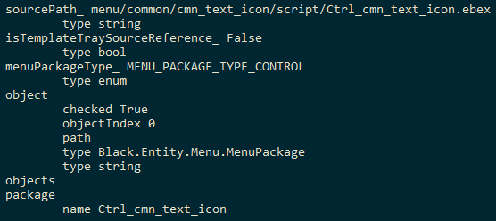

# Final Fantasy XV research

This document is a mirror from my [old research page](https://www.lucianociccariello.com/research/finalfantasyxv) written back in March 2018.

* [Mods](#mods)
* [EXML data and scripting format (XMB / XMB2)](#exml-data-and-scripting-format)
* [XMB format](#xmb-format)
* [XMB2 format](#xmb2-format)

## Mods

Unlocking Ansel allows to me to do things like [this video](https://youtu.be/sAaBgAHh7L0).

### Final Fantasy XV Benchmark

All the offsets and values are expressed in decimal numbers.

#### Disable ALSR (benchmark)

Memory offsets will not change if you restart the game. Useful for Cheat Engine.

Offset `486` from `96` to `32`

#### Defeat the anti-debugger (benchmark)

The game normally closes when a debugger is attached. This will prevent that anti-debugging feature.

Offset `3535807` from `133` to `51`
Offset `3535827` from `133` to `51`

#### Ansel anywhere (benchmark)

Allows to use Nvidia Ansel anywhere: during cutscenes, loading screens and even CGI movies!

Offset `46009569` from `0` to `127`

### Final Fantasy XV Windows Demo

#### Disable ALSR (demo)

Memory offsets will not change if you restart the game. Useful for Cheat Engine.

Offset `478` from `96` to `32`

#### Defeat the anti-debugger (demo)

Offset `3707039` from `133` to `51`
Offset `3707059` from `133` to `51`

#### Ansel anywhere (demo)

Allows to use Nvidia Ansel anywhere: during cutscenes, loading screens and even CGI movies!

Offset `46234849` from `0` to `127`

## EXML data and scripting format

The Luminous Engine uses a data container called EXML, which is the extension of those files. An EXML is no more than a XML file serialized in binary for faster loading. Two versions of EXML exists: XMB used by Episode Duscae and Platinum Demo, XMB2 used by the complete game.

## XMB format

This format has been cracked by [Xeeynamo](https://github.com/xeeynamo) for both reading and writing. The code can be found on [my GitHub repo](https://github.com/xeeynamo/ffxv/FFXV.Services/).

The format is straight forward to read. You start from the `RootElement`, get `Elements[RootElement]` (that we will call `e` from now on) and you can start to read the name of the root node element with `Names[e.NameTableOffset]` and its attributes from `Attributes[AttributeTableIndex[[e.AttributeTableIndex]]` to `Attributes[AttributeTableIndex[[e.AttributeTableIndex + e.AttributeCount - 1]]` and its child elements from `Elements[ElementTableIndex[[e.ElementTableIndex]]` to `Elements[ElementTableIndex[[e.ElementTableIndex + e.ElementCount - 1]]`. Recursively, each child element will be the new `e`.

Each attribute has its own value, that can be obtained using `Variants[currentAttribute.VariantOffset]`. The same can be said for the `Element`, but only when `currentElement.ElementCount` is `0` (leaf node). When an `Element` or an `Attribute` does not contain a value, the `VariantOffset` will point to a `Variant[k]` where its `NameStringOffset` points to a string with `length = 0`.

The described algorithm can be found in [`Xmb.Read.cs`](https://github.com/Xeeynamo/ffxv/blob/master/FFXV.Services/Xmb.Read.cs).

Once read successfully, the output will look like the following (eg. `ctrl_cmn_text_icon.exml`):

### Xmb.Header structure

| Offset | Type | Name | Description
|--------|------|------|-------------
| 0x00   | u32  | Magic Code | Fixed to 584D 4200 (or "XMB\0")
| 0x04   | u32  | Unused | Always set to 0
| 0x08   | Xmb.Entry | Elements | A descriptor for the ElementTable
| 0x10   | Xmb.Entry | Attributes | A descriptor for the AttributeTable, which contains all the possible XML Attribute entries
| 0x18   | Xmb.Entry | Names | A descriptor for the NameTable, where a series of null-terminated string are stored
| 0x20   | Xmb.Entry | ElementTableIndexes | A descriptor for the ElementTableIndex, which contains indices between 0 and Elements.Count
| 0x28   | Xmb.Entry | AttributeTableIndexes | A descriptor for the AttributeTableIndex, which contains indices between 0 and Attributes.Count
| 0x30   | Xmb.Entry | Variants | A descriptor for the VariantTable
| 0x38   | u32  | ElementRoot | Contains an index between 0 and Elements.Count that represents the offset for the Element that acts as XML Root Node
| 0x3C   | u32  | Unused | Always set to 0
| 0x40   | u32  | Unused | Always set to 0
| 0x44   | u32  | Unused | Always set to 0
| 0x48   | u32  | Unused | Always set to 0
| Elements.Offset | Xmb.ElementTable[Elements.Count] | ElementTable | Contains all the possible XML Element entries, avoiding duplicates (up to the compiler)
| Attributes.Offset | Xmb.AttributeTable[Attributes.Count] | AttributeTable | Contains all the possible XML Attribute entries, avoiding duplicates (up to the compiler)
| Variants.Offset | Xmb.VariantTable[Variants.Count] | VariantTable | Contains all the possible values for both Elements and Attributes, avoiding duplicates (up to the compiler)
| Names.Offset | char[TableNames.Count] | Names | Data of names used from the different tables
| ElementTableIndices.Offset | u32[ElementTableIndices.Count] | ElementTableIndex[] | Contains values between 0 and Elements.Count, used to hold a list of Element for an Element node
| AttributeTableIndices.Offset | u32[AttributeTableIndices.Count] | AttributeTableIndex[] | Contains values between 0 and Attributes.Count, used to hold a list of Attribute for an Element

### Xmb.Entry structure

| Offset | Type | Name | Description
|--------|------|------|-------------
| 0x00   | u32  | Offset | Where the data is located, starting from the beginning of the file
| 0x04   | u32  | Count | The number of items in the array

### Xmb.ElementTable structure

| Offset | Type | Name | Description
|--------|------|------|-------------
| 0x00   | u64  | Reserved | The game uses it to store a pointer to the parser itself. Always set to 0
| 0x08   | u32  | AttributeTableIndex | Offset to the Attribute Table, which contains an array of indices
| 0x0C   | u32  | AttributeCount | The number of consecutive attributes starting from AttributeTableIndex
| 0x10   | u32  | ElementTableIndex | Offset to the Element Table, which contains an array of indices
| 0x14   | u32  | ElementCount | The number of consecutive attributes starting from ElementTableIndex
| 0x18   | u32  | NameStringOffset | Offset to Name Table, starting from NameTable.Offset. Holds the name of the Element.
| 0x1C   | u32  | VariantOffset | Offset to Variant Table, starting from VariantTable.Offset. Gives an optional string representation for the element's value.

### Xmb.AttributeTable structure

| Offset | Type | Name | Description
|--------|------|------|-------------
| 0x00   | u64  | Reserved | The game uses it to store a pointer to the parser itself. Always set to 0
| 0x08   | u32  | NameStringOffset | Offset to Name Table, starting from NameTable.Offset. Holds the name of the Attribute.
| 0x0C   | u32  | VariantOffset | Offset to Variant Table, starting from VariantTable.Offset. Gives an optional string representation for the attribute's value.

### Xmb.VariantTable structure

| Offset | Type | Name | Description
|--------|------|------|-------------
| 0x00   | ValueType | Type | Describes what is the value type of the entry
| 0x04   | u32  | NameStringOffset | Offset to Name Table, starting from NameTable.Offset. Holds the name of the Attribute.
| 0x08   | byte[16] | Data | The data itself; VariantTable.Type will describe how the data should be interpreted

### ValueType

| Value | Name | Description
|-------|------|-------------
| 1     | Generic | Can be anything. Not quite sure on how this is used
| 2     | Bool | The value is a boolean
| 3     | Signed | The value is a int32_t, which the upper bit (little endian) is the sign flag
| 4     | Unsigned | The value is a u32
| 5     | Float | The value is a float IEEE 754
| 6     | Vector2 | Vector of 2 float IEEE 754 values
| 7     | Vector3 | Vector of 3 float IEEE 754 values
| 8     | Vector4 | Vector of 4 float IEEE 754 values

## XMB2 format

The structure of XMB2 is very different from XMB and it is meant to be lighter than XMB in order to save storage space.

The format has been cracked too and the [source code](https://github.com/Xeeynamo/ffxv/blob/master/FFXV.Services/Xmb2.cs) is available. Converting a XMB2 into an XML is done but producing a XMB2 currently produces very unoptimized files.
